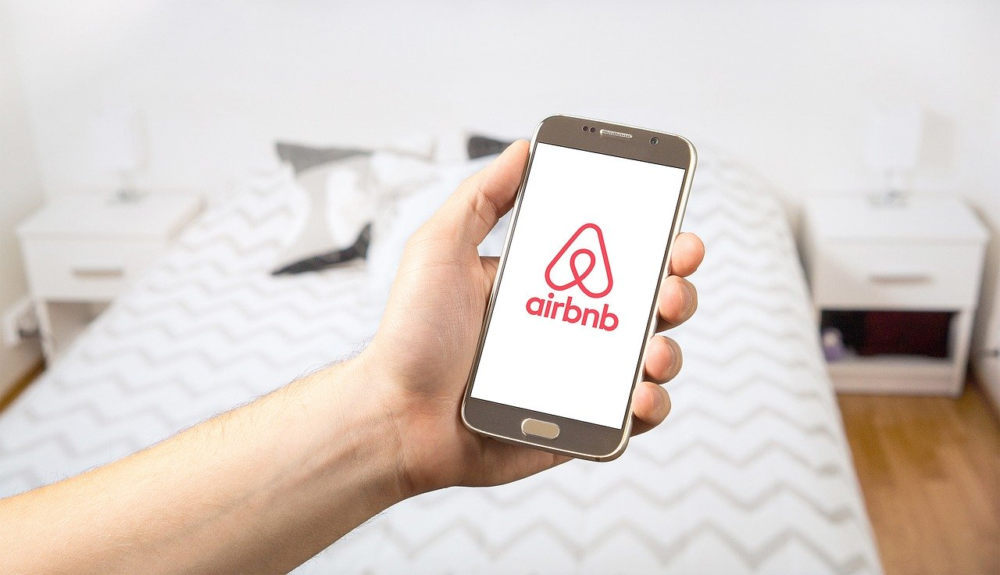
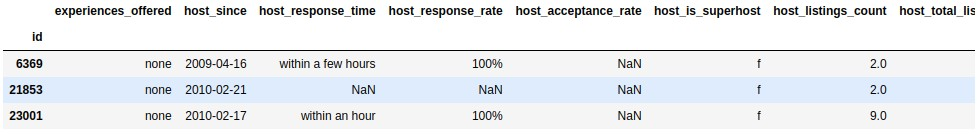
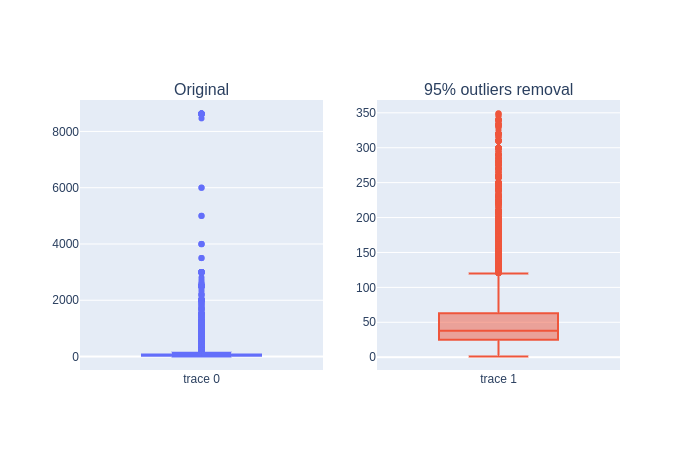
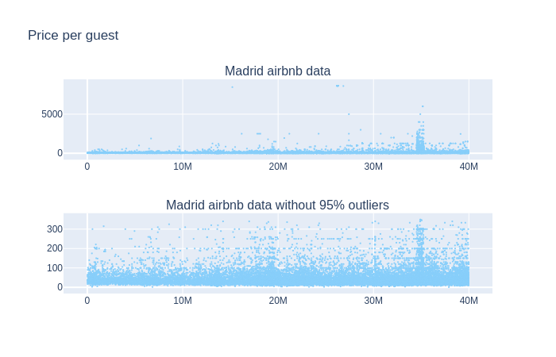
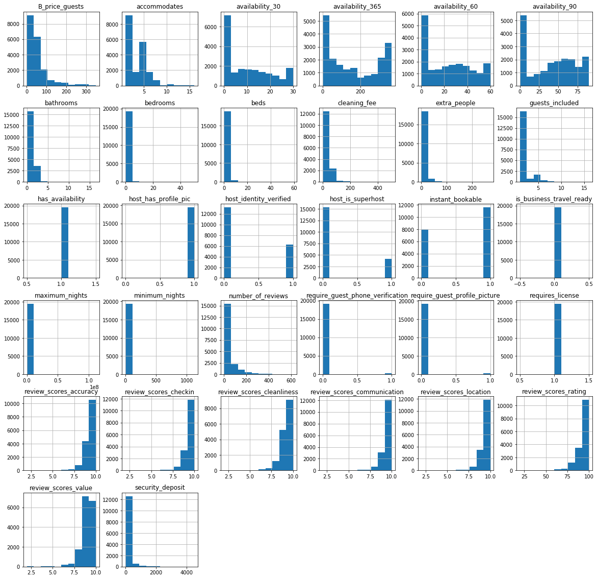
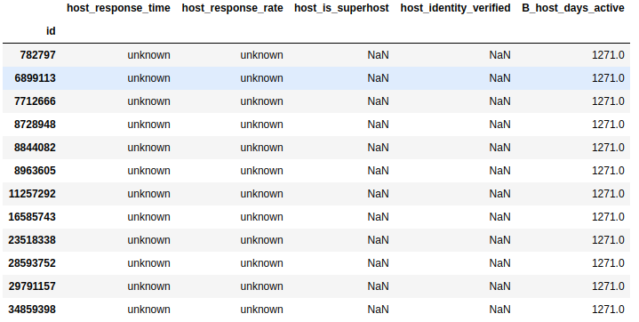

# Analysing Madrid Airbnb data using Plotly, Mapbox and Geopandas

## Introduction
Airbnb is the world’s biggest accommodation-sharing site. Its rapid growth and impact on vacation rentals has generated heated discussions about its effect in several of the world's largest cities. So much that regulations have emerged against the free use of this website:

* Amsterdam: the rental of complete houses is limited to 60 days a year and this will be reduced by half
* Barcelona: short-term rentals must have a license and new licenses are not being issued
* Berlin: owners need a permission to rent 50% or more of their main residence for a short period of time
* London: short-term rentals of entire houses are restricted to 90 days a year
* Palma: the mayor has announced the ban on short-term rentals
* New York: It is usually illegal to rent apartments for 30 consecutive days or less, unless the host is present
* Paris: short-term rentals are limited to 120 days a year
* San Francisco: hosts must register as a company and obtain certificates for short-term rental. The rental of entire properties is limited to 90 days a year
* Singapore: the minimum period of public housing rental is six consecutive months
* Tokyo: home sharing was legalized only in 2017 and is limited to 180 days a year

<i>Source: https://www.bbc.com/mundo/noticias-45355426</i>

Given the [Airbnb dataset of Madrid](http://insideairbnb.com/get-the-data.html), we propose to obtain the following information:
## Objectives
The data will be processed to clean them and get as much information as possible. A statistical analysis will attempt to solve the following questions:
* Which areas have the most Airbnb properties, and which are the most expensive?
* Which amenities increase the price of an Airbnb listing?
* Influence of host features in the median price

## Processing the data

### Import the data
The dataset used for this project comes from Insideairbnb.com. The dataset was scraped on 2019-11-09 and contains information on all Madrid Airbnb listings that were live on the site on that date (20.539)

I will not import free text fields and I will remove the currency symbol from fields with amounts. "smart_location", "zipcode" are redundant having latitude and longitude. "reviews_per_month", "number_of_reviews_ltm" with "number_of_reviews" too. url fields does not add value to the model. I don't import "host_name", "host_location" and "host_about" too.

### Cleaning the features

I will drop columns with more than 85% nulls: ['host_acceptance_rate', 'square_feet', 'monthly_price', 'jurisdiction_names', 'weekly_price']

We only use latitude, longitude and neighbourhood_cleansed location. As we are studying Madrid, the city and country columns do not contribute anything

<table border="1" class="dataframe">
  <thead>
    <tr style="text-align: right;">
      <th>id</th>
      <th>latitude</th>
      <th>longitude</th>
    </tr>
  </thead>
  <tbody>
    <tr>
      <th>6369</th>
      <td>40.45628</td>
      <td>-3.67763</td>
    </tr>
    <tr>
      <th>21853</th>
      <td>40.40341</td>
      <td>-3.74084</td>
    </tr>
    <tr>
      <th>23001</th>
      <td>40.38695</td>
      <td>-3.69304</td>
    </tr>
    <tr>
      <th>24805</th>
      <td>40.42202</td>
      <td>-3.70395</td>
    </tr>
    <tr>
      <th>24836</th>
      <td>40.41995</td>
      <td>-3.69764</td>
    </tr>
  </tbody>
</table>

For the number of nights we will only leave "minimum_nights" and "maximum_nights". We will change the price column for the price per guest

<table border="1" class="dataframe">
  <thead>
    <tr style="text-align: right;">
      <th>id</th>
      <th>B_price_guests</th>
    </tr>
  </thead>
  <tbody>
    <tr>
      <th>6369</th>
      <td>35.00</td>
    </tr>
    <tr>
      <th>21853</th>
      <td>17.00</td>
    </tr>
    <tr>
      <th>23001</th>
      <td>60.00</td>
    </tr>
    <tr>
      <th>24805</th>
      <td>40.00</td>
    </tr>
    <tr>
      <th>24836</th>
      <td>28.75</td>
    </tr>
  </tbody>
</table>

We'll eliminate prices per guest above quantile 95. Thus we will eliminate possible artificially high prices due to the effect of smart pricing

Thus we eliminate prices per guest that exceed 5000 and even reach 9000 dollars. Let's compare prices per guest in both dataset

We don't lose the two concentrations near the ids 20M and 35M. Now, let's represent each column to review them.

Columns with only one category will be deleted: 
> ['has_availability', 'host_has_profile_pic', 'is_business_travel_ready' ,'require_guest_phone_verification', 'require_guest_profile_picture', 'requires_license']

### Categorical features
We review the categorical and datetime variables one by one
> ['experiences_offered', 'host_since', 'host_response_time', 'host_response_rate', 'host_is_superhost', 'host_identity_verified', 'neighbourhood_cleansed', 'market', 'property_type', 'room_type',
 'bed_type', 'amenities', 'calendar_updated', 'first_review', 'last_review', 'license', 'instant_bookable', 'cancellation_policy']

**experiences_offered:** we erase it because there is only one value

**host_since:** date that the host first joined Airbnb. We will calculate the difference of days and replace the nulls with the median

**host_response_time:** average amount of time the host takes to reply to messages. There is some possible values and nans. This nans we will impute these to a new value: unknown
> within an hour        11625 
unknown                3498 
within a few hours     2539 
within a day           1382 
a few days or more      408

**host_response_rate:** analogous case but for which we will group in a categorical variable: "unknown", [0-49%], [50-89%], [90-99%] y 100%
> 100%       10906 
90-99%      2310 
50-89%      2172 
0-49%        566 
unknown     3498

**host_is_superhost:** whether or not the host is a superhost, which is a mark of quality for the top-rated and most experienced hosts. There are only 12 nans. We will review the rest of columns "host_"

"host_is_superhost", "host_listings_count" and "host_identity_verified" has the same nulls. We drop these listings

**host_identity_verified:** whether or not the host has been verified with id. There are no nulls

> f: 13179 
t: 6261

**neighbourhood_cleansed:** There are no nulls

**market:** virtually there is only significant value. We eliminate it

> Madrid: 19406 
Other (International): 4 
Other (Domestic): 1

**property_type:** there are too much property types. We will group them into 3 categories: house, apartment and others.

>Apartment: 17909 
House: 1113 
Other: 418

**room_type:** we will group 'Hotel room' into 'Private room'

> Entire home/apt: 12078 
Private room: 7134 
Shared room: 228

**bed_type:** this feature is "Real Bed" in the 99% os dataset. We drop this column

**calendar_updated:** This feature does not add value to the model. Dropped

**license:** it's a license granted by the Community of Madrid. The majority (81%) is null. It's a free text column but we can group them in "t" (has license) and "f" for nans values

> f: 15778 
t: 3662 

**instant_bookable:** whether or not the property can be instant booked. It has no null values

> t: 11564 
f: 7876

**cancellation_policy:** whether or not the property can be instant booked. It has no null values but we need to regroup categories

> strict_14_with_grace_period: 7243 
flexible: 6152 
moderate: 6045

**first_review:** there are 15.9% of ads without review. We add a new column "B_time_since_first_review" that we will group in 5 categories:

> 0-6 months: 3652 
6-12 months: 2231 
1-2 years: 3667 
2+ years: 6804 
no reviews: 3086

**last_review:** we add a new column "B_time_since_last_review" that we will group in 5 categories:

> 0-2 weeks     5758 
2-8 weeks     5199 
2-6 months    2500 
6+ months     2897 
no reviews    3086

**amenities:** additional features in the property, e.g. whether it has a TV or parking. This data is a list and we need to **extract a list of all posibles amenities**

I define the following groupings of amenities:
 > B_amenities_pets: Pets allowed / Other pet / Dog / Cat / Pets live on this property 
B_amenities_kitchen: Kitchen / Kitchenette / Full kitchen 
B_amenities_high_kitchen: Warming drawer / Wine cooler / Steam oven / Double oven 
B_amenities_high_bedroom: Firm mattress / Memory foam mattress / Pillow-top mattress 
B_amenities_outdoor: BBQ grill / Terrace / Outdoor seating / Patio or balcony / Hammock / Garden or backyard / Balcony / Sun loungers 
B_amenities_family_friendly: Family\/kid friendly / Changing table / Baby bath / Crib / Children’s books and toys / Pack ’n Play\/travel crib / Fireplace guards / Babysitter recommendations / Window guards / Children’s dinnerware / Stair gates / Table corner guards / Outlet covers / Baby monitor / High chair 
B_amenities_home_appliances: Washer \/ Dryer / Refrigerator / Mini fridge / Gas oven / Cooking basics / Dryer / Convection oven / Microwave / Washer / Oven / Dishes and silverware / Iron / Dishwasher 
B_amenities_high_electronics: HBO GO / Smart TV / Netflix / Projector and screen / Game console / Amazon Echo 
B_amenities_normal_electronics: DVD player / Printer / TV / Cable TV / Sound system / High-resolution computer monitor 
B_amenities_special_accessibility: Fixed grab bars for shower / Accessible-height bed / Extra space around bed / Pool with pool hoist / Electric profiling bed / Accessible-height toilet / Wide doorway to guest bathroom / Ground floor access / Single level home / Wheelchair accessible / Disabled parking spot / Shower chair / No stairs or steps to enter / Step-free shower / Bathtub with bath chair / Wide entrance / Fixed grab bars for toilet / Wide entrance for guests / Flat path to guest entrance / Mobile hoist / Wide clearance to shower / Wide hallways / Wide entryway 
B_amenities_breakfast_appliances: Espresso machine / Hot water kettle / Coffee maker 
B_amenities_gym: Gym / Exercise equipment 
B_amenities_pool: Shared pool / Pool 
B_amenities_heating: Heated towel rack / Heating / Heated floors / Stove 
B_amenities_other: Other / Essentials / Breakfast table / Beach essentials / Buzzer\/wireless intercom / Formal dining area / Ceiling fan / Day bed / Room-darkening shades / Laptop friendly workspace / Standing valet 
B_amenities_views: Beach view / Ski-in/Ski-out / Waterfront / Beachfront / Beachfront 
B_amenities_internet: Ethernet connection / Wifi / Pocket wifi / Internet 
B_amenities_bathroom_basics: Hot water / Walk-in shower / Bathtu / Soaking tub / Handheld shower head / Bath towel / Bidet / Shampoo / Rain shower / Body soap / toilet / Bathroom essentials / Toilet paper / Hair dryer 
B_amenities_cleaning_before_checkout: Cleaning before checkout 
B_amenities_bedroom_basics: Bedroom comforts / Extra pillows and blankets / Bed linens / Hangers 
B_amenities_security: Lockbox / Lock on bedroom door 
B_amenities_indoor_fireplace: Indoor fireplace 
B_amenities_staff: Building staff / Doorman 
B_amenities_smoking: Smoking allowed 
B_amenities_high_bathroom: Jetted tub / Touchless faucets / Hot tub 
B_amenities_cleaning_before_checkout: Cleaning before checkout     
B_amenities_proximity_host: Host greets you 
B_amenities_general_accesibility: Well-lit path to entrance / Elevator 
B_amenities_free_parking: Free street parking / Free parking on premises   
B_amenities_paid_parking: Paid parking on premises / Paid parking off premises 
B_amenities_air_conditioning: Central air conditioning / Air conditioning 
B_amenities_privacy: Private living room / Private bathroom / Private entrance / En suite bathroom 
B_amenities_safety: Fire extinguisher / Carbon monoxide detector / Smoke detector / Safety card / First aid kit 
B_amenities_luggage: Mudroom / Luggage dropoff allowed     
B_amenities_ev_charger: EV charger      
B_amenities_breakfast: Breakfast 
B_amenities_self_check: Keypad / 24-hour check-in / Self check-in / Smart lock     
B_amenities_suitable_events: Suitable for events 
B_amenities_long_term: Long term stays allowed)'

