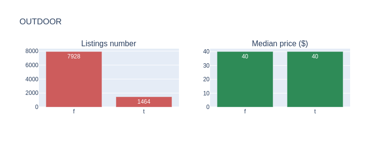

# Investment analysis: Madrid Airbnb

## Introduction
Airbnb is the world’s biggest accommodation-sharing site. Its rapid growth and impact on vacation rentals has generated heated discussions about its effect in several of the world's largest cities. So much that regulations have emerged against the free use of this website that could damage a possible inversion:

* Amsterdam: the rental of complete houses is limited to 60 days a year and this will be reduced by half
* Barcelona: short-term rentals must have a license and new licenses are not being issued
* Berlin: owners need a permission to rent 50% or more of their main residence for a short period of time
* London: short-term rentals of entire houses are restricted to 90 days a year
* Palma: the mayor has announced the ban on short-term rentals
* New York: It is usually illegal to rent apartments for 30 consecutive days or less, unless the host is present
* Paris: short-term rentals are limited to 120 days a year
* San Francisco: hosts must register as a company and obtain certificates for short-term rental. The rental of entire properties is limited to 90 days a year
* Singapore: the minimum period of public housing rental is six consecutive months
* Tokyo: home sharing was legalized only in 2017 and is limited to 180 days a year

<i>Source: https://www.bbc.com/mundo/noticias-45355426</i>

In addition to choosing a business-friendly city with Airbnb, what is the best way to maximize the return on an investment in real estate with this website? To discover it, we will downloaded the data offered by [Airbnb dataset of Madrid](http://insideairbnb.com/get-the-data.html) and analyze it. We propose to obtain the following information with a statistical analysis:

* Which areas have the most Airbnb properties, and which are the most expensive?
* Which amenities increase the price of an Airbnb listing?
* Influence of host features in the median price

## Which areas have the most Airbnb properties, and which are the most expensive?

These are all Madrid listings:

<i>Distribution of Madrid listings. Point color indicates price per guest</i>

We group by neighbourhood and filter the neighbourhoods with 50, 100 and 500 listings or greater:

**We can see that the largest number of houses is in the center.**

### Price per guest included
Mean or median? There are listings with a high price and only one guest included, but its "accomodates" is high. Let's use median to soften those anomalies

There are peripheral areas with a high median. Let's filter by min 50$

 

<table border="1" class="dataframe">
  <thead>
    <tr style="text-align: right;">
      <th>Neighbourhood</th>
      <th>Number of listings</th>
      <th>Median price per guest</th>
    </tr>
  </thead>
  <tbody>
    <tr>
      <th>Castellana</th>
      <td>168</td>
      <td>65.0</td>
    </tr>
    <tr>
      <th>Cuatro Vientos</th>
      <td>7</td>
      <td>75.0</td>
    </tr>
    <tr>
      <th>El Goloso</th>
      <td>11</td>
      <td>60.0</td>
    </tr>
    <tr>
      <th>El Viso</th>
      <td>71</td>
      <td>70.0</td>
    </tr>
    <tr>
      <th>Hispanoamérica</th>
      <td>100</td>
      <td>62.0</td>
    </tr>
    <tr>
      <th>Palomas</th>
      <td>17</td>
      <td>59.0</td>
    </tr>
    <tr>
      <th>Recoletos</th>
      <td>274</td>
      <td>65.0</td>
    </tr>
    <tr>
      <th>Valdemarín</th>
      <td>5</td>
      <td>60.0</td>
    </tr>
    <tr>
      <th>Vallehermoso</th>
      <td>56</td>
      <td>54.5</td>
    </tr>
  </tbody>
</table>

 

**The areas with the highest median price are no longer all concentrated in the city center**. The "Cuatro Vientos" area is notable, surely there is a high demand due to the air base sited there. However it has little offer (could it be a business opportunity?), which would explain these high prices.

<table border="1" class="dataframe">
  <thead>
    <tr style="text-align: right;">
      <th>Listing id</th>
      <th>Price per guest</th>
      <th>Neighbourhood</th>
    </tr>
  </thead>
  <tbody>
    <tr>
      <th>20324976</th>
      <td>75.0</td>
      <td>Cuatro Vientos</td>
    </tr>
    <tr>
      <th>30261870</th>
      <td>15.0</td>
      <td>Cuatro Vientos</td>
    </tr>
    <tr>
      <th>33801693</th>
      <td>55.0</td>
      <td>Cuatro Vientos</td>
    </tr>
    <tr>
      <th>35125746</th>
      <td>17.0</td>
      <td>Cuatro Vientos</td>
    </tr>
    <tr>
      <th>35157642</th>
      <td>250.0</td>
      <td>Cuatro Vientos</td>
    </tr>
    <tr>
      <th>35184131</th>
      <td>200.0</td>
      <td>Cuatro Vientos</td>
    </tr>
    <tr>
      <th>36707244</th>
      <td>100.0</td>
      <td>Cuatro Vientos</td>
    </tr>
  </tbody>
</table>

 

## Which amenities increase the price of an Airbnb listing?
There are too much amenities to study! We need to **extract the information and regroup in categories of similar features**

 

 

I define the following groupings of amenities:
> Pets: Pets allowed / Other pet / Dog / Cat / Pets live on this property
> 
> Kitchen: Kitchen / Kitchenette / Full kitchen
> 
> High kitchen: Warming drawer / Wine cooler / Steam oven / Double oven
> 
> High bedroom: Firm mattress / Memory foam mattress / Pillow-top mattress
> 
> Outdoor: BBQ grill / Terrace / Outdoor seating / Patio or balcony / Hammock / Garden or backyard / Balcony / Sun loungers
> 
> Family friendly: Family\/kid friendly / Changing table / Baby bath / Crib / Children’s books and toys / Pack ’n Play\/travel crib / Fireplace guards / Babysitter recommendations / Window guards / Children’s dinnerware / Stair gates / Table corner guards / Outlet covers / Baby monitor / High chair
> 
> Home appliances: Washer \/ Dryer / Refrigerator / Mini fridge / Gas oven / Cooking basics / Dryer / Convection oven / Microwave / Washer / Oven / Dishes and silverware / Iron / Dishwasher
> 
> High electronics: HBO GO / Smart TV / Netflix / Projector and screen / Game console / Amazon Echo
> 
> Normal electronics: DVD player / Printer / TV / Cable TV / Sound system / High-resolution computer monitor
> 
> Special accessibility: Fixed grab bars for shower / Accessible-height bed / Extra space around bed / Pool with pool hoist / Electric profiling bed / Accessible-height toilet / Wide doorway to guest bathroom / Ground floor access / Single level home / Wheelchair accessible / Disabled parking spot / Shower chair / No stairs or steps to enter / Step-free shower / Bathtub with bath chair / Wide entrance / Fixed grab bars for toilet / Wide entrance for guests / Flat path to guest entrance / Mobile hoist / Wide clearance to shower / Wide hallways / Wide entryway
> 
> Breakfast appliances: Espresso machine / Hot water kettle / Coffee maker
> 
> Gym: Gym / Exercise equipment
> 
> Pool: Shared pool / Pool
> 
> Heating: Heated towel rack / Heating / Heated floors / Stove
> 
> Other: Other / Essentials / Breakfast table / Beach essentials / Buzzer\/wireless intercom / Formal dining area / Ceiling fan / Day bed / Room-darkening shades / Laptop friendly workspace / Standing valet
>  
> Views: Beach view / Ski-in/Ski-out / Waterfront / Beachfront / Beachfront
> 
> Internet: Ethernet connection / Wifi / Pocket wifi / Internet
> 
> Bathroom basics: Hot water / Walk-in shower / Bathtu / Soaking tub / Handheld shower head / Bath towel / Bidet / Shampoo / Rain shower / Body soap / toilet / Bathroom essentials / Toilet paper / Hair dryer
> 
> Cleaning before checkout: Cleaning before checkout
> 
> Bedroom basics: Bedroom comforts / Extra pillows and blankets / Bed linens / Hangers
> 
> Security: Lockbox / Lock on bedroom door
> 
> Indoor fireplace: Indoor fireplace
> 
> Staff: Building staff / Doorman
> 
> Smoking: Smoking allowed
> 
> High bathroom: Jetted tub / Touchless faucets / Hot tub
>    
> Proximity_host: Host greets you
> 
> General accesibility: Well-lit path to entrance / Elevator
> 
> Free parking: Free street parking / Free parking on premises
>   
> Paid parking: Paid parking on premises / Paid parking off premises
> 
> Air conditioning: Central air conditioning / Air conditioning
> 
> Privacy: Private living room / Private bathroom / Private entrance / En suite bathroom
> 
> Safety: Fire extinguisher / Carbon monoxide detector / Smoke detector / Safety card / First aid kit
> 
> Luggage: Mudroom / Luggage dropoff allowed
>     
> EV Charger: EV charger
>      
> Breakfast: Breakfast
> 
> Self_check: Keypad / 24-hour check-in / Self check-in / Smart lock
>   
> Suitable for events: Suitable for events
> 
> Long term: Long term stays allowed

We will remove those amenities groups that are offered by more than 90% and those that are below 10%

* High frequent:
  * Kitchen
  * Home appliances
  * Heating
  * Other
  * Internet
  * Bathroom basics

* Low frequent:
  * High kitchen
  * High bedroom
  * High electronics
  * Gym
  * Pool
  * Views
  * Cleaning before checkout
  * Indoor fireplace
  * Staff
  * High bathroom
  * EV Charger
  * Suitable for events

The rest of amenities groups are found in the ads in the following percentage

<pre>Pets                     14.88
Outdoor                  15.28
Family friendly          39.74
Normal electronics       79.95
Special accessibility    21.90
Breakfast appliances     41.92
Bedroom basics           85.70
Security                 16.91
Smoking                  20.98
Proximity host           35.32
General accesibility     61.44
Free parking             16.25
Paid parking             31.90
Air conditioning         63.65
Privacy                  21.67
Safety                   45.11
Luggage                  19.00
Breakfast                11.88
Self check               14.77
Long term                29.51</pre>

And now the distribution of amenities in the listings versus the median price

  

    
  

  

      
  

  

      
  

  

      
  

  

      
  

  

      
  

  

      
  

  

      
  

  

      
  

  

      
  

  

      
  

  

      
  

  

      
  

  

      
  

  

      
  

  

      
  

  

      
  

  

      
  

  

      
  

  

      
  

**These are the things that seem to influence (positively) the median price:**

* Normal electronics: DVD player, Printer, TV, Cable TV, Sound system, High-resolution computer monitor
* Air conditioning: Central air conditioning, Air conditioning

**What if only the neighborhoods with the highest number of listings are reviewed?**

  

    
  

  

      
  

  

      
  

  

      
  

  

      
  

  

      
  

  

      
  

  

      
  

  

      
  

  

      
  

  

      
  

  

      
  

  

      
  

  

      
  

  

      
  

  

      
  

  

      
  

  

      
  

  

      
  

  

      
  

**In neighborhoods where competition is greater, others amenities begin to influence the price.** It's also important to remember that the neighborhoods with the highest number of ads are in the city center

* Normal electronics: DVD player, Printer, TV, Cable TV, Sound system, High-resolution computer monitor
* Air conditioning: Central air conditioning, Air conditioning
* General accesibility (little): Well-lit path to entrance, Elevator. 

*In the center there are old buildings without an elevator. Maybe for that reason customers look for the house to have an elevator in these neighborhoods*

* Free parking: Free street parking, Free parking on premises.

*It's difficult to park the car in the central neighborhoods*

* Privacy: Private living room, Private bathroom, Private entrance, En suite bathroom

## Influence of host features
We want to analyze how categorical variables related to the host affect the median price. We'll use another histograms

* Host response time
* Host response rate
* Host is superhost
* Host identity verified

  

    
  

  

      
  

  

      
  

  

      
  

### **Host response time and host response rate**

The "worst" categories are those with the highest median price. It seems that this feature does not "cause" the price, but is a consequence of the price above the median. The host knows that he has a well-valued property in Air Bnb and does not give such exhaustive attention to potential clients

### **Host is superhost and host identity verified**

The definition of 'superhost', according to [Air Bnb](https://www.airbnb.co.uk/help/article/828/what-is-a-superhost?_set_bev_on_new_domain=1579644646_eBD%2Bqp6saBYIE3Z7)

> *"Superhosts are experienced hosts who provide a shining example for other hosts and extraordinary experiences for their guests"*

The definition of 'host identity verified', according to [Air Bnb](https://www.airbnb.co.uk/help/article/1237/how-does-it-work-when-airbnb-verifies-your-identity?_set_bev_on_new_domain=1579644646_eBD%2Bqp6saBYIE3Z7)

> *At Airbnb, we’re always working on making our community as secure as possible for everyone. That’s why, before booking a home or experience, or becoming a host, we may ask for a government ID or ask you to confirm your legal name and add your address*

**In both cases there is no effect on the price**

## Conclusions

**Which areas have the most Airbnb properties, and which are the most expensive?**
  * Most properties: The city center, without exceptions
  * Most expensive: The city center but there are quite a few neighborhoods far from the center with a high price

**Which amenities increase the price of an Airbnb listing?**
  * Normal electronics: DVD player, Printer, TV, Cable TV, Sound system, High-resolution computer monitor
  * Air conditioning: Central air conditioning, Air conditioning

In neighborhoods with a lot of Airbnb offer:

  * Free parking: Free street parking, Free parking on premises.
  * Privacy: Private living room, Private bathroom, Private entrance, En suite bathroom

**Influence of host features in the median price**

There is no effect on the price with this amenities