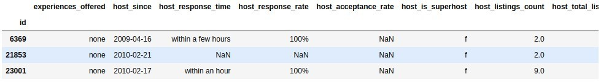

# Analysing Madrid Airbnb data using Plotly, Mapbox and Geopandas

## Introduction
Airbnb is the world’s biggest accommodation-sharing site. Its rapid growth and impact on vacation rentals has generated heated discussions about its effect in several of the world's largest cities. So much that regulations have emerged against the free use of this website:

* Amsterdam: the rental of complete houses is limited to 60 days a year and this will be reduced by half
* Barcelona: short-term rentals must have a license and new licenses are not being issued
* Berlin: owners need a permission to rent 50% or more of their main residence for a short period of time
* London: short-term rentals of entire houses are restricted to 90 days a year
* Palma: the mayor has announced the ban on short-term rentals
* New York: It is usually illegal to rent apartments for 30 consecutive days or less, unless the host is present
* Paris: short-term rentals are limited to 120 days a year
* San Francisco: hosts must register as a company and obtain certificates for short-term rental. The rental of entire properties is limited to 90 days a year
* Singapore: the minimum period of public housing rental is six consecutive months
* Tokyo: home sharing was legalized only in 2017 and is limited to 180 days a year

<i>Source: https://www.bbc.com/mundo/noticias-45355426</i>

Given the [Airbnb dataset of Madrid](http://insideairbnb.com/get-the-data.html), we propose to obtain the following information:
## Objectives
The data will be processed to clean them and get as much information as possible. A statistical analysis will attempt to solve the following questions:
* Which areas have the most Airbnb properties, and which are the most expensive?
* Which amenities increase the price of an Airbnb listing?
* Influence of host features in the median price

## Processing the data

### Import the data
The dataset used for this project comes from Insideairbnb.com. The dataset was scraped on 2019-11-09 and contains information on all Madrid Airbnb listings that were live on the site on that date (20.539)

I will not import free text fields and I will remove the currency symbol from fields with amounts. "smart_location", "zipcode" are redundant having latitude and longitude. "reviews_per_month", "number_of_reviews_ltm" with "number_of_reviews" too. url fields does not add value to the model. I don't import "host_name", "host_location" and "host_about" too.

### Cleaning the features

I will drop columns with more than 85% nulls: ['host_acceptance_rate', 'square_feet', 'monthly_price', 'jurisdiction_names', 'weekly_price']

We only use latitude, longitude and neighbourhood_cleansed location. As we are studying Madrid, the city and country columns do not contribute anything

<table border="1" class="dataframe">
  <thead>
    <tr style="text-align: right;">
      <th>id</th>
      <th>latitude</th>
      <th>longitude</th>
    </tr>
  </thead>
  <tbody>
    <tr>
      <th>6369</th>
      <td>40.45628</td>
      <td>-3.67763</td>
    </tr>
    <tr>
      <th>21853</th>
      <td>40.40341</td>
      <td>-3.74084</td>
    </tr>
    <tr>
      <th>23001</th>
      <td>40.38695</td>
      <td>-3.69304</td>
    </tr>
    <tr>
      <th>24805</th>
      <td>40.42202</td>
      <td>-3.70395</td>
    </tr>
    <tr>
      <th>24836</th>
      <td>40.41995</td>
      <td>-3.69764</td>
    </tr>
  </tbody>
</table>

For the number of nights we will only leave "minimum_nights" and "maximum_nights". We will change the price column for the price per guest

<table border="1" class="dataframe">
  <thead>
    <tr style="text-align: right;">
      <th>id</th>
      <th>B_price_guests</th>
    </tr>
  </thead>
  <tbody>
    <tr>
      <th>6369</th>
      <td>35.00</td>
    </tr>
    <tr>
      <th>21853</th>
      <td>17.00</td>
    </tr>
    <tr>
      <th>23001</th>
      <td>60.00</td>
    </tr>
    <tr>
      <th>24805</th>
      <td>40.00</td>
    </tr>
    <tr>
      <th>24836</th>
      <td>28.75</td>
    </tr>
  </tbody>
</table>

We'll eliminate prices per guest above quantile 95. Thus we will eliminate possible artificially high prices due to the effect of smart pricing

Thus we eliminate prices per guest that exceed 5000 and even reach 9000 dollars. Let's compare prices per guest in both dataset

We don't lose the two concentrations near the ids 20M and 35M. Now, let's represent each column to review them.

Columns with only one category will be deleted: 
> ['has_availability', 'host_has_profile_pic', 'is_business_travel_ready' ,'require_guest_phone_verification', 'require_guest_profile_picture', 'requires_license']

## Answering questions
* Which areas have the most Airbnb properties, and which are the most expensive?

### Listings number
These are all Madrid listings:

<i>Distribution of Madrid listings. Point color indicates price per guest</i>

We group by "neighbourhood_cleansed" and filter the neighbourhoods with 50, 100 and 500 listings or greater:

We can see that the largest number of houses is in the center.

### Price per guest included
Mean or median? There are listings with a high price and only one guest included, but its "accomodates" is high. Let's use median to soften those anomalies

There are peripheral areas with a high median. Let's filter by min 50$

 

<table border="1" class="dataframe">
  <thead>
    <tr style="text-align: right;">
      <th>neighbourhood_cleansed</th>
      <th>number_of_listings</th>
      <th>median_price</th>
    </tr>
  </thead>
  <tbody>
    <tr>
      <th>Castellana</th>
      <td>168</td>
      <td>65.0</td>
    </tr>
    <tr>
      <th>Cuatro Vientos</th>
      <td>7</td>
      <td>75.0</td>
    </tr>
    <tr>
      <th>El Goloso</th>
      <td>11</td>
      <td>60.0</td>
    </tr>
    <tr>
      <th>El Viso</th>
      <td>71</td>
      <td>70.0</td>
    </tr>
    <tr>
      <th>Hispanoamérica</th>
      <td>100</td>
      <td>62.0</td>
    </tr>
    <tr>
      <th>Palomas</th>
      <td>17</td>
      <td>59.0</td>
    </tr>
    <tr>
      <th>Recoletos</th>
      <td>274</td>
      <td>65.0</td>
    </tr>
    <tr>
      <th>Valdemarín</th>
      <td>5</td>
      <td>60.0</td>
    </tr>
    <tr>
      <th>Vallehermoso</th>
      <td>56</td>
      <td>54.5</td>
    </tr>
  </tbody>
</table>

 
The areas with the highest median price are no longer all concentrated in the city center. The "Cuatro Vientos" area is notable, surely there is a high demand due to the air base sited there. However it has little offer, which would explain these high prices.

<table border="1" class="dataframe">
  <thead>
    <tr style="text-align: right;">
      <th>id</th>
      <th>latitude</th>
      <th>longitude</th>
      <th>B_price_guests</th>
      <th>neighbourhood_cleansed</th>
    </tr>
  </thead>
  <tbody>
    <tr>
      <th>20324976</th>
      <td>40.37025</td>
      <td>-3.77034</td>
      <td>75.0</td>
      <td>Cuatro Vientos</td>
    </tr>
    <tr>
      <th>30261870</th>
      <td>40.36806</td>
      <td>-3.76347</td>
      <td>15.0</td>
      <td>Cuatro Vientos</td>
    </tr>
    <tr>
      <th>33801693</th>
      <td>40.37194</td>
      <td>-3.77140</td>
      <td>55.0</td>
      <td>Cuatro Vientos</td>
    </tr>
    <tr>
      <th>35125746</th>
      <td>40.36734</td>
      <td>-3.76397</td>
      <td>17.0</td>
      <td>Cuatro Vientos</td>
    </tr>
    <tr>
      <th>35157642</th>
      <td>40.36698</td>
      <td>-3.76177</td>
      <td>250.0</td>
      <td>Cuatro Vientos</td>
    </tr>
    <tr>
      <th>35184131</th>
      <td>40.36721</td>
      <td>-3.76252</td>
      <td>200.0</td>
      <td>Cuatro Vientos</td>
    </tr>
    <tr>
      <th>36707244</th>
      <td>40.37160</td>
      <td>-3.76639</td>
      <td>100.0</td>
      <td>Cuatro Vientos</td>
    </tr>
  </tbody>
</table>

 

## Which amenities increase the price of an Airbnb listing?
We will draw a barchart for every amenity group to compare number of listings versus median price.

**amenities:** additional features in the property, e.g. whether it has a TV or parking. This data is a list and we need to **extract a list of all posibles amenities**

 

 

I define the following groupings of amenities:
> B_amenities_pets: Pets allowed / Other pet / Dog / Cat / Pets live on this property
> 
> B_amenities_kitchen: Kitchen / Kitchenette / Full kitchen
> 
> B_amenities_high_kitchen: Warming drawer / Wine cooler / Steam oven / Double oven
> 
> B_amenities_high_bedroom: Firm mattress / Memory foam mattress / Pillow-top mattress
> 
> B_amenities_outdoor: BBQ grill / Terrace / Outdoor seating / Patio or balcony / Hammock / Garden or backyard / Balcony / Sun loungers
> 
> B_amenities_family_friendly: Family\/kid friendly / Changing table / Baby bath / Crib / Children’s books and toys / Pack ’n Play\/travel crib / Fireplace guards / Babysitter recommendations / Window guards / Children’s dinnerware / Stair gates / Table corner guards / Outlet covers / Baby monitor / High chair
> 
> B_amenities_home_appliances: Washer \/ Dryer / Refrigerator / Mini fridge / Gas oven / Cooking basics / Dryer / Convection oven / Microwave / Washer / Oven / Dishes and silverware / Iron / Dishwasher
> 
> B_amenities_high_electronics: HBO GO / Smart TV / Netflix / Projector and screen / Game console / Amazon Echo
> 
> B_amenities_normal_electronics: DVD player / Printer / TV / Cable TV / Sound system / High-resolution computer monitor
> 
> B_amenities_special_accessibility: Fixed grab bars for shower / Accessible-height bed / Extra space around bed / Pool with pool hoist / Electric profiling bed / Accessible-height toilet / Wide doorway to guest bathroom / Ground floor access / Single level home / Wheelchair accessible / Disabled parking spot / Shower chair / No stairs or steps to enter / Step-free shower / Bathtub with bath chair / Wide entrance / Fixed grab bars for toilet / Wide entrance for guests / Flat path to guest entrance / Mobile hoist / Wide clearance to shower / Wide hallways / Wide entryway
> 
> B_amenities_breakfast_appliances: Espresso machine / Hot water kettle / Coffee maker
> 
> B_amenities_gym: Gym / Exercise equipment
> 
> B_amenities_pool: Shared pool / Pool
> 
> B_amenities_heating: Heated towel rack / Heating / Heated floors / Stove
> 
> B_amenities_other: Other / Essentials / Breakfast table / Beach essentials / Buzzer\/wireless intercom / Formal dining area / Ceiling fan / Day bed / Room-darkening shades / Laptop friendly workspace / Standing valet
>  
> B_amenities_views: Beach view / Ski-in/Ski-out / Waterfront / Beachfront / Beachfront
> 
> B_amenities_internet: Ethernet connection / Wifi / Pocket wifi / Internet
> 
> B_amenities_bathroom_basics: Hot water / Walk-in shower / Bathtu / Soaking tub / Handheld shower head / Bath towel / Bidet / Shampoo / Rain shower / Body soap / toilet / Bathroom essentials / Toilet paper / Hair dryer
> 
> B_amenities_cleaning_before_checkout: Cleaning before checkout
> 
> B_amenities_bedroom_basics: Bedroom comforts / Extra pillows and blankets / Bed linens / Hangers
> 
> B_amenities_security: Lockbox / Lock on bedroom door
> 
> B_amenities_indoor_fireplace: Indoor fireplace
> 
> B_amenities_staff: Building staff / Doorman
> 
> B_amenities_smoking: Smoking allowed
> 
> B_amenities_high_bathroom: Jetted tub / Touchless faucets / Hot tub
>    
> B_amenities_proximity_host: Host greets you
> 
> B_amenities_general_accesibility: Well-lit path to entrance / Elevator
> 
> B_amenities_free_parking: Free street parking / Free parking on premises
>   
> B_amenities_paid_parking: Paid parking on premises / Paid parking off premises
> 
> B_amenities_air_conditioning: Central air conditioning / Air conditioning
> 
> B_amenities_privacy: Private living room / Private bathroom / Private entrance / En suite bathroom
> 
> B_amenities_safety: Fire extinguisher / Carbon monoxide detector / Smoke detector / Safety card / First aid kit
> 
> B_amenities_luggage: Mudroom / Luggage dropoff allowed
>     
> B_amenities_ev_charger: EV charger
>      
> B_amenities_breakfast: Breakfast
> 
> B_amenities_self_check: Keypad / 24-hour check-in / Self check-in / Smart lock
>   
> B_amenities_suitable_events: Suitable for events
> 
> B_amenities_long_term: Long term stays allowed

We will build a dataframe with the groups of defined amenities that we will add to obtain the totals (%) of each group. We will remove those that offer more than 90% of ads and those that are below 10%

> high_frequent_cols: ['B_amenities_kitchen', 'B_amenities_home_appliances', 'B_amenities_heating', 'B_amenities_other', 'B_amenities_internet', 'B_amenities_bathroom_basics']

> low_frequent_cols: ['B_amenities_high_kitchen', 'B_amenities_high_bedroom', 'B_amenities_high_electronics', 'B_amenities_gym', 'B_amenities_pool', 'B_amenities_views', 'B_amenities_cleaning_before_checkout', 'B_amenities_indoor_fireplace', 'B_amenities_staff', 'B_amenities_high_bathroom', 'B_amenities_ev_charger', 'B_amenities_suitable_events']

<pre>B_amenities_pets                     14.88
B_amenities_outdoor                  15.28
B_amenities_family_friendly          39.74
B_amenities_normal_electronics       79.95
B_amenities_special_accessibility    21.90
B_amenities_breakfast_appliances     41.92
B_amenities_bedroom_basics           85.70
B_amenities_security                 16.91
B_amenities_smoking                  20.98
B_amenities_proximity_host           35.32
B_amenities_general_accesibility     61.44
B_amenities_free_parking             16.25
B_amenities_paid_parking             31.90
B_amenities_air_conditioning         63.65
B_amenities_privacy                  21.67
B_amenities_safety                   45.11
B_amenities_luggage                  19.00
B_amenities_breakfast                11.88
B_amenities_self_check               14.77
B_amenities_long_term                29.51</pre>

If it is null we change it to an "f". If it is not for a "t". Let's draw a histogram to see the columns we have obtained by extracting the information from "amenities"

  

    
  

  

      
  

  

      
  

  

      
  

  

      
  

  

      
  

  

      
  

  

      
  

  

      
  

  

      
  

  

      
  

  

      
  

  

      
  

  

      
  

  

      
  

  

      
  

  

      
  

  

      
  

  

      
  

  

      
  

These are the things that seem to influence (positively) the median price:

* Normal electronics: DVD player, Printer, TV, Cable TV, Sound system, High-resolution computer monitor
* Air conditioning: Central air conditioning, Air conditioning

What if only the neighborhoods with the highest number of listings are reviewed?

  

    
  

  

      
  

  

      
  

  

      
  

  

      
  

  

      
  

  

      
  

  

      
  

  

      
  

  

      
  

  

      
  

  

      
  

  

      
  

  

      
  

  

      
  

  

      
  

  

      
  

  

      
  

  

      
  

  

      
  

Others amenities begin to influence the price because these neighborhoods are in the center of the city 

* Normal electronics: DVD player, Printer, TV, Cable TV, Sound system, High-resolution computer monitor 
* Air conditioning: Central air conditioning, Air conditioning 
* General accesibility (little): Well-lit path to entrance, Elevator. In the center there are old buildings without an elevator. Maybe for that reason customers look for the house to have an elevator in these neighborhoods 
* Free parking: Free street parking, Free parking on premises. It's difficult to park the car in the central neighborhoods 
* Privacy: Private living room, Private bathroom, Private entrance, En suite bathroom 

## Influence of host features
We want to analyze how categorical variables related to the host affect the median price. We'll use another histograms
* 'host_response_time'
* 'host_response_rate'
* 'host_is_superhost'
* 'host_identity_verified'

**host_response_time:** average amount of time the host takes to reply to messages. There is some possible values and nans. This nans we will impute these to a new value: unknown

<pre>
within an hour        11625
within a few hours     2539
within a day           1382
a few days or more      408
unknown                3498 
</pre>

**host_response_rate:** analogous case but for which we will group in a categorical variable: "unknown", [0-49%], [50-89%], [90-99%] y 100%

<pre>
100%       10906
90-99%      2310
50-89%      2172
0-49%        566
unknown     3498
</pre>

**host_is_superhost:** whether or not the host is a superhost, which is a mark of quality for the top-rated and most experienced hosts. There are only 12 nans. We will review the rest of columns "host_"

"host_is_superhost", "host_listings_count" and "host_identity_verified" has the same nulls. We drop these listings

**host_identity_verified:** whether or not the host has been verified with id. There are no nulls

<pre>
f: 13179
t: 6261
</pre>

  

    
  

  

      
  

  

      
  

  

      
  

**'host_response_time' and 'host_response_rate'**

The "worst" categories are those with the highest median price. It seems that this feature does not "cause" the price, but is a consequence of the price above the median. The host knows that he has a well-valued property in Air Bnb and does not give such exhaustive attention to potential clients

**'host_is_superhost' and 'host_identity_verified'**

The definition of 'host_is_superhost', according to [Air Bnb](https://www.airbnb.co.uk/help/article/828/what-is-a-superhost?_set_bev_on_new_domain=1579644646_eBD%2Bqp6saBYIE3Z7) 

> "Superhosts are experienced hosts who provide a shining example for other hosts and extraordinary experiences for their guests"

The definition of 'host_identity_verified', according to [Air Bnb](https://www.airbnb.co.uk/help/article/1237/how-does-it-work-when-airbnb-verifies-your-identity?_set_bev_on_new_domain=1579644646_eBD%2Bqp6saBYIE3Z7)

> At Airbnb, we’re always working on making our community as secure as possible for everyone. That’s why, before booking a home or experience, or becoming a host, we may ask for a government ID or ask you to confirm your legal name and add your address

In both cases there is no effect on the price